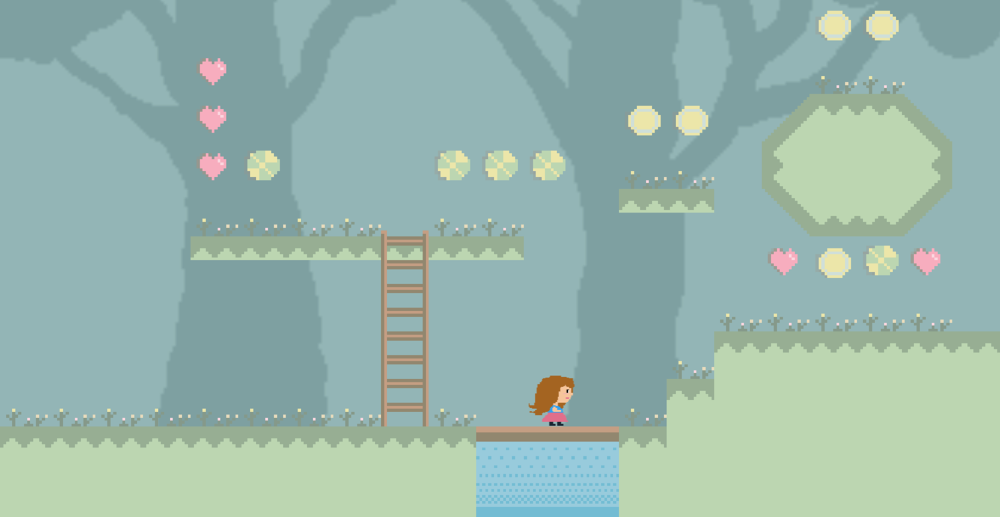

# Demo

- [https://stefanygeraldine.github.io/cute-game/](https://stefanygeraldine.github.io/shaders-patterns/)

# Having fun doing Pixel Art my fisrt try

This project is a first try doing pixel art and implementing 
the amazing Pixi.js 2D library. I created a simple game where you can move 
a character with the arrow keys and jump using the space bar. The goal is to
collect heads (in process this feature).